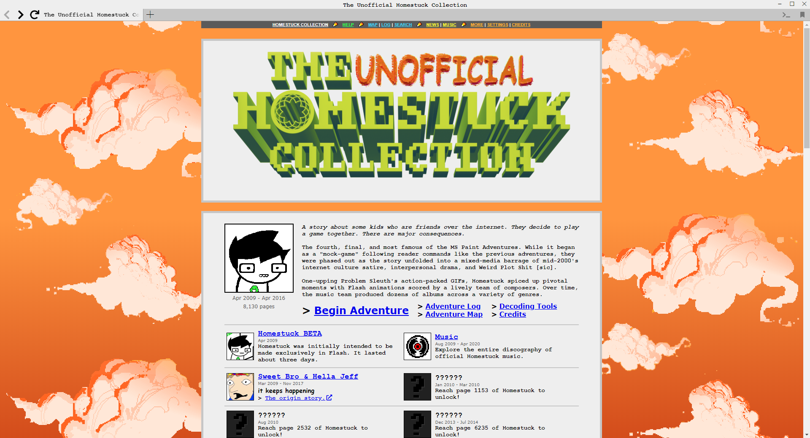

# Cloud BG Changer
Mod for [The Unofficial Homestuck Collection](https://bambosh.github.io/unofficial-homestuck-collection/) V2 or later. (Tested on V2.0.4)
Allows you to change the 'default' background clouds (as seen in the homepage, help pages, settings, etc.) to suit your mood.

Currently includes sunset and night cloud variations, as well as some subtle gradient background options for each that I think look quite nice. There is also a 'dynamic' option that switches to night clouds only when in Dark Mode.

Previews (with gradients):

